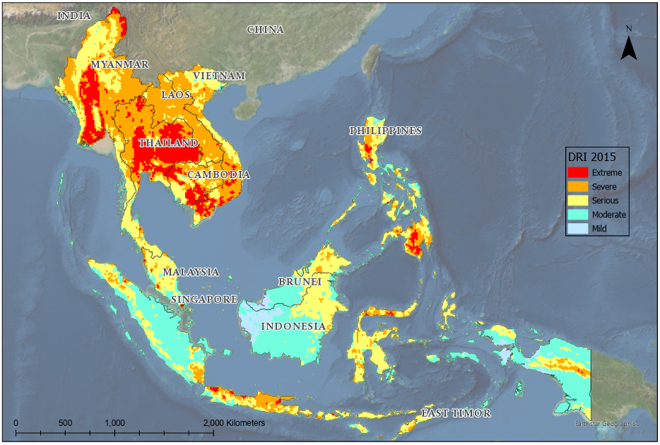
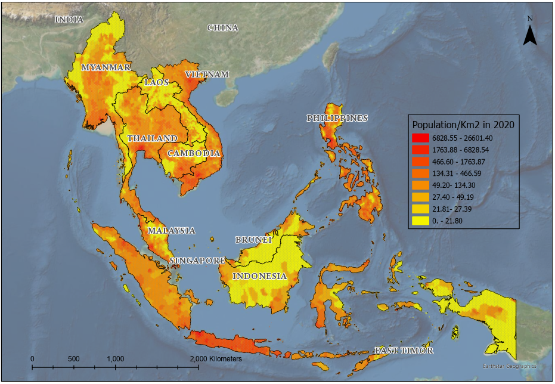

*© Chathurika Thilakarathna, 2026.  
This repository documents original MSc research work. Shared for academic
and professional reference.*

# GIS-Based Drought Risk Analysis 
*MSc Dissertation: Cloud-based open-source approach for drought risk assessment: Case Study Southeast Asia*

## Study Context
This research was conducted as part of an MSc in Geospatial Science at RMIT University
and focuses on GIS-based drought risk assessment using spatial analysis and remote
sensing techniques.

## Abstract
This research developed a reproducible, cloud-based open-source framework for
drought risk assessment and applied it across the Southeast Asian region. Key methods
include deriving drought-related parameters using the Google Earth Engine (GEE)
platform; calculating three risk components: Drought Hazard Index (DHI), Drought
Exposure Index (DEI) and Drought Vulnerability Index (DVI); and constructing a composite
Drought Risk Index (DRI) using GIS. The analysis incorporated the Standardized
Precipitation Index (SPI), Vegetation Health Index (VHI), Soil Moisture Index (SMI), Palmer
Drought Severity Index (PDSI), land use/land cover (LULC), slope, elevation, and
population density. An equal-weighted overlay technique was applied to generate DHI,
DEI, DVI, and the composite DRI. Drought risk was assessed for the years 2015 and 2020.
Results indicated higher drought risk in mainland regions compared to island regions in
both years, while greater drought severity was observed in 2015 than in 2020. Thailand
exhibited the highest drought risk among mainland countries, while among island
nations, the Philippines showed the highest severity and Brunei the lowest impact. SPI,
SMI, VHI, and LULC contributed most significantly to regional drought risk, with
agricultural areas consistently exhibiting higher vulnerability. VHI and SMI showed strong
associations with other parameters. The proposed framework is adaptable for drought
monitoring in other regions and can support policymakers in understanding drought
drivers and informing mitigation strategies at global and regional scales.

Keywords: Google Earth Engine (GEE), Drought Risk Index (DRI), drought hazard index
(DHI), Drought Exposure Index (DEI), Drought Vulnerability Index (DVI), drought indices,
bivariate correlation, cloud-based open-source.

### Region Map

## Methodological Framework
• Remote sensing and climatic datasets were acquired and preprocessed using
  Google Earth Engine to support large-scale spatiotemporal analysis.

• Key drought-related indicators were derived from environmental and climate variables.

• All indicators were integrated and analysed within desktop GIS environments,
  including ArcGIS Pro and QGIS.

• Indicators were standardised and weighted according to their relative contribution
  to drought risk.

• A GIS-based weighted overlay approach was applied to generate a composite drought
  risk index.

• The resulting index was spatially classified and mapped to identify drought risk
  patterns and vulnerable regions.
  
 
  ## Data Sources
The drought risk assessment utilised multiple publicly available remote sensing and
climate datasets, including precipitation (CHIRPS), drought indices (TerraClimate),
soil moisture (SMAP), vegetation condition (MODIS NDVI), land surface temperature
(MODIS LST), land use/land cover (Copernicus), elevation (SRTM), and population
distribution (WorldPop). Data processing and extraction were primarily conducted
using Google Earth Engine.

 ## Drought indices
  • Drought indices were computed using established formulations (e.g. SPI, SMI),
  with a composite drought risk index derived through weighted integration of
  standardised indicators.
  
[View drought indices and formulations →](methodology/indices.md)

## Key Outputs
• A GIS-based drought risk index integrating multiple climatic and environmental
  indicators.

• Spatial drought risk maps illustrating the distribution of low, moderate, and high
  drought risk across the study area.

• Classification of drought-prone regions to identify spatial patterns of vulnerability.

• Thematic maps designed to support environmental assessment, planning, and resource
  management.

## Selected Spatial Results

### Drought Risk Index Maps

#### Drought Risk Index 2015

#### Drought Risk Index 2020

### Population Density South East Asia

## Statistical Analysis

### Distribution of Drought Indicators by Region 2015

### Distribution of Drought Indicators by Region 2020

